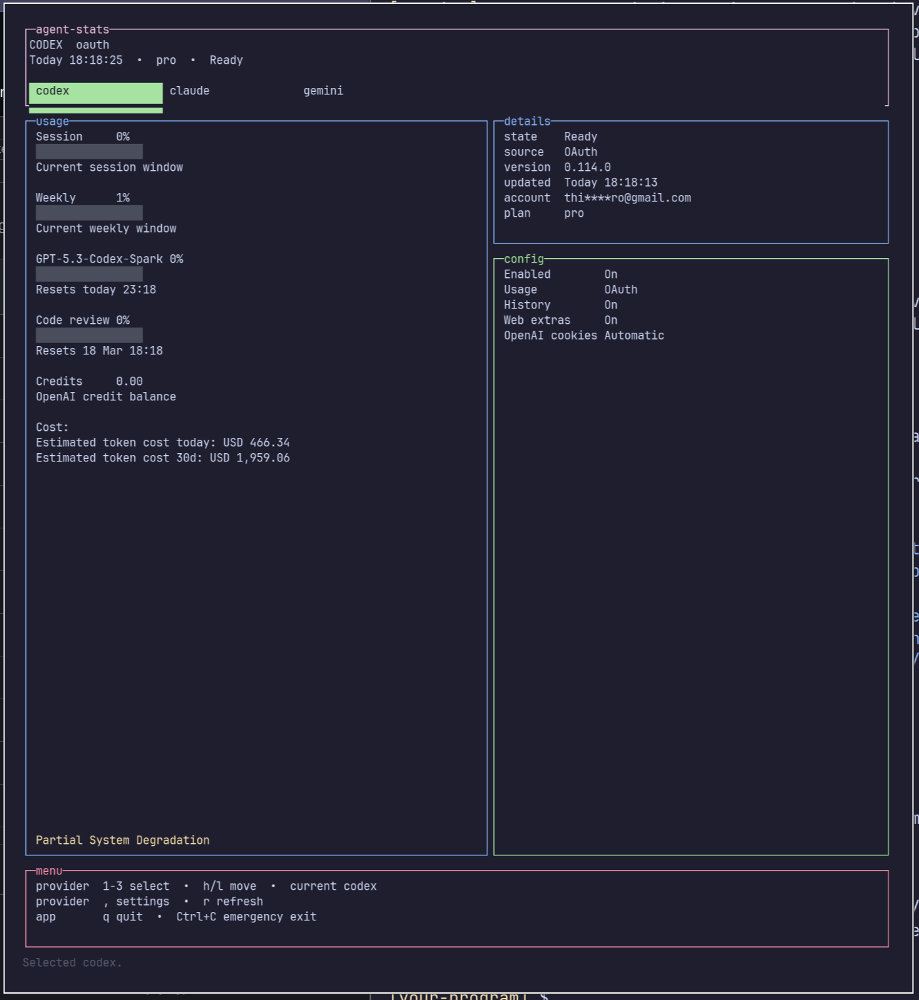

# CodexBarOmarchy

Terminal-first provider usage dashboard for Omarchy.

Inspired by [CodexBar](https://github.com/steipete/CodexBar), this project brings the same general idea to an Omarchy-flavored Linux setup: keep your AI provider usage, account state, and service health visible without leaving the terminal.



## What It Does

- Shows a keyboard-driven TUI for `codex`, `claude`, and `gemini`
- Renders with your active Omarchy theme
- Tracks usage windows, account identity, plan, version, and provider status
- Surfaces service degradation when the provider status pages expose it
- Persists provider settings in a local config file
- Exposes a headless JSON snapshot via `bun run stats`
- Scans local Codex and Claude history to estimate token cost totals

This repository is currently focused on `codex`, `claude`, and `gemini`. It is closer to "CodexBar for Omarchy" than a full Linux port of the upstream macOS app.

## How It Works

1. On first run, the app detects installed provider CLIs and creates `~/.config/omarchy-agent-bar/config.json`.
2. The headless runtime refreshes each enabled provider through provider-specific adapters.
3. Those adapters read local CLI auth files, optional web/cookie-backed session data, and provider status endpoints.
4. The TUI presents the current snapshot, and the non-interactive stats command prints the same state as JSON.

## Providers

- `codex`: CLI or OAuth-backed usage, optional OpenAI web extras, and local token-cost history
- `claude`: CLI, OAuth, or web-backed usage with saved token accounts for manual cookie mode
- `gemini`: Gemini CLI OAuth-backed quota tracking with workspace status support

## Install

### Requirements

- [Bun](https://bun.sh/) 1.3+
- Omarchy if you want automatic theme pickup
- Any provider CLIs you want to monitor: `codex`, `claude`, and/or `gemini`

### Setup

```bash
bun install
```

### Local Release Bundle Preview

The first install packaging slice can now build a local release bundle:

```bash
bun install
bun run package:release -- 0.1.0
tar -xzf dist/release/omarchy-agent-bar-0.1.0-linux-x64.tar.gz -C /tmp
bash /tmp/omarchy-agent-bar-0.1.0-linux-x64/install.sh
```

That installer currently performs a user-local install using:

- `~/.local/share/omarchy-agent-bar/<version>/`
- `~/.local/share/omarchy-agent-bar/current`
- `~/.local/bin/omarchy-agent-bar`
- `~/.config/autostart/omarchy-agent-bar.desktop`

It leaves `~/.config/omarchy-agent-bar/config.json` in place on uninstall.

## Usage

Launch the interactive TUI:

```bash
bun run tui
```

Run the tray entrypoint:

```bash
bun run tray
```

The repo-local `tray` script uses the development identity suffix `dev`, so it does not collide with a future installed production build that uses `org.omarchy.agent-stats`.

Print the current provider state as JSON:

```bash
bun run stats
```

Common keys in the TUI:

- `1-3`: switch provider tabs
- `h` / `l`: move between providers
- `,`: open settings
- `r`: refresh the selected provider
- `q`: quit
- `Ctrl+C`: emergency exit

If `stdout` is not a TTY, `bun run tui` falls back to a plain-text snapshot instead of the interactive renderer.

The local bundle installer now writes an XDG autostart desktop entry that launches:

```bash
~/.local/bin/omarchy-agent-bar tray
```

Release automation is still deferred. The current packaging flow is local-first so the install layout can be proven before wiring GitHub Releases.

## Configuration

- Config file: `~/.config/omarchy-agent-bar/config.json`
- Config permissions are written as `0600`
- Omarchy theme lookup:
  - `~/.config/omarchy/current/theme/colors.toml`
  - `~/.local/share/omarchy/current/theme/colors.toml`
- Override theme path with `OMARCHY_THEME_PATH`

## Development

```bash
bun run test
bun run e2e:tui
bun run lint
bun run typecheck
```

`bun run stats` is useful for scripting and verification because it prints a JSON snapshot and excludes secret token values from saved Claude token accounts.

## Releases

Release automation is wired through Release Please in `.github/workflows/release-please.yml`.

The intended flow is:

1. conventional commits land on `main`
2. Release Please opens or updates a release PR
3. merging that release PR creates the tag, changelog update, and GitHub release
4. the same workflow builds the packaged release bundle and uploads the `.tar.gz` asset plus checksum

Important:

- Release Please only creates a release PR after releasable commits land on `main`
- the important conventional commit prefixes are `feat:` and `fix:`
- `build:` and `chore:` commits by themselves are not releasable units in Release Please's default model
